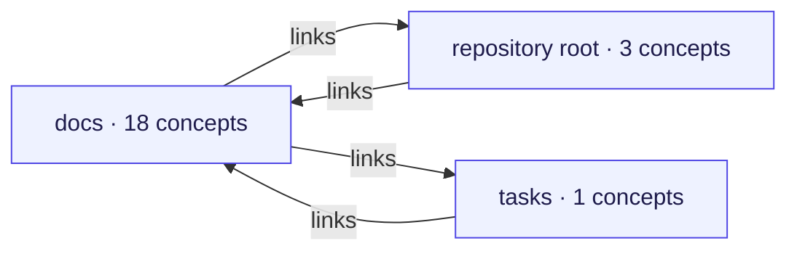
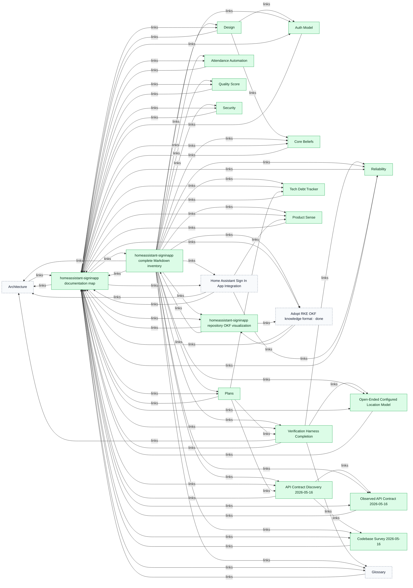
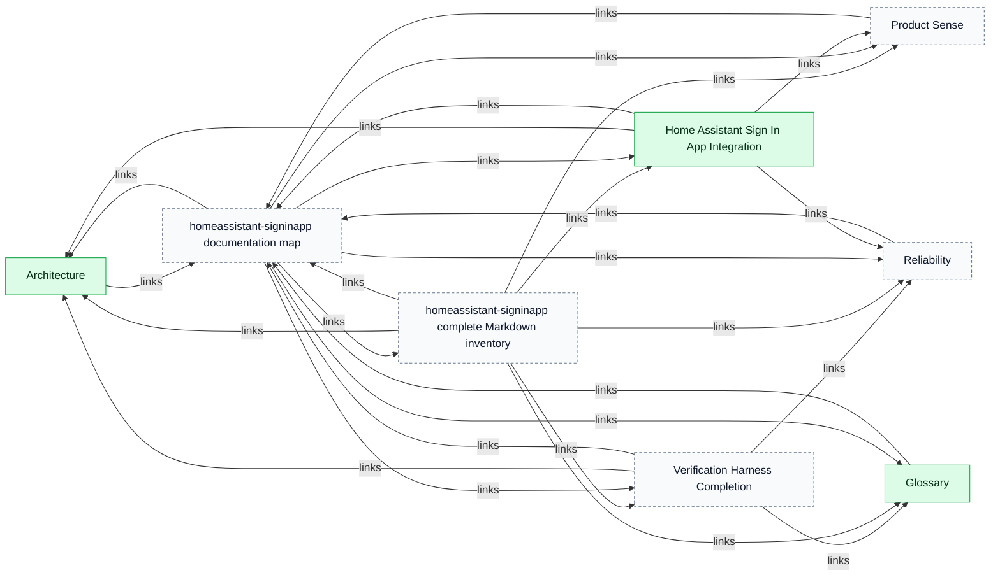
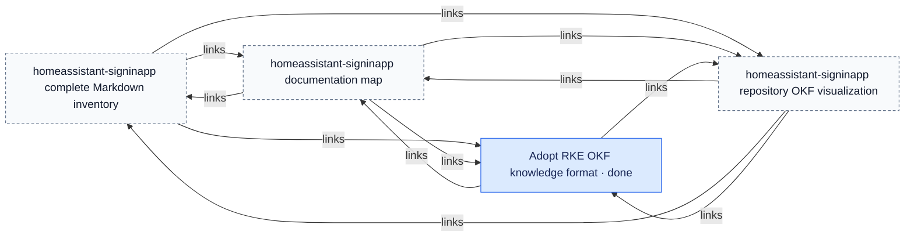
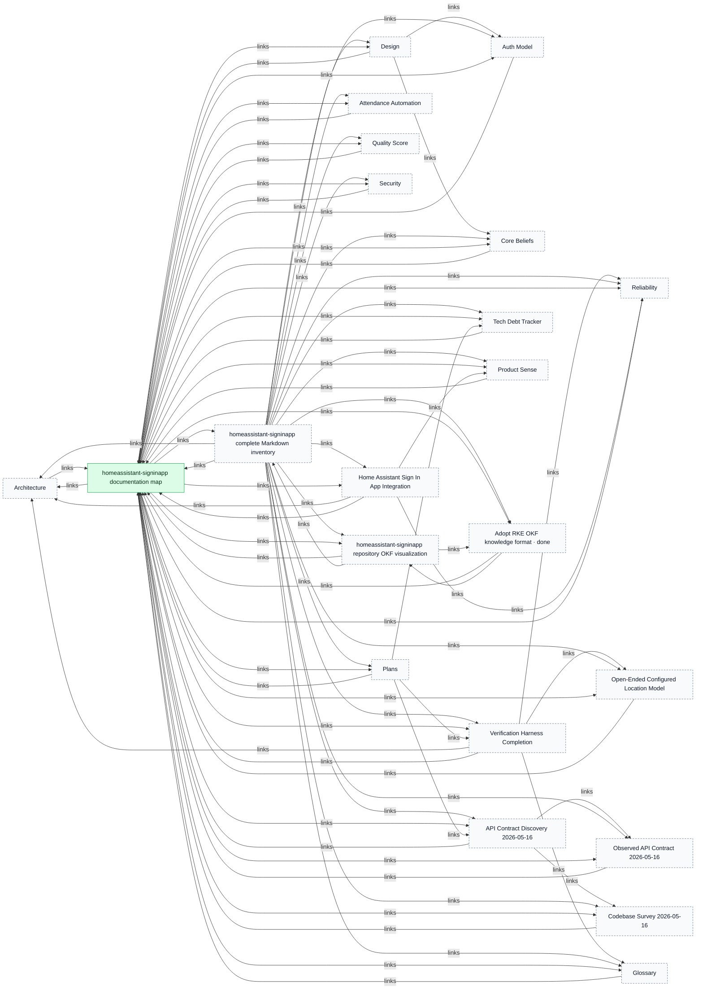
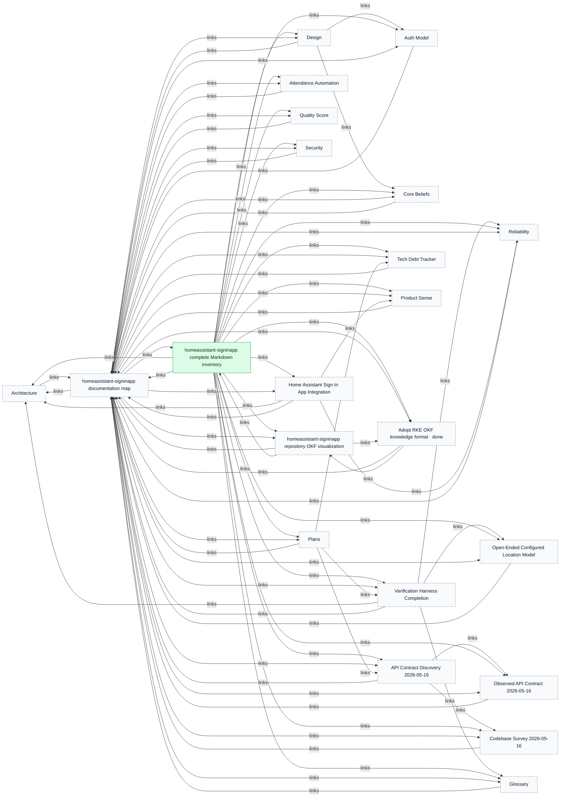
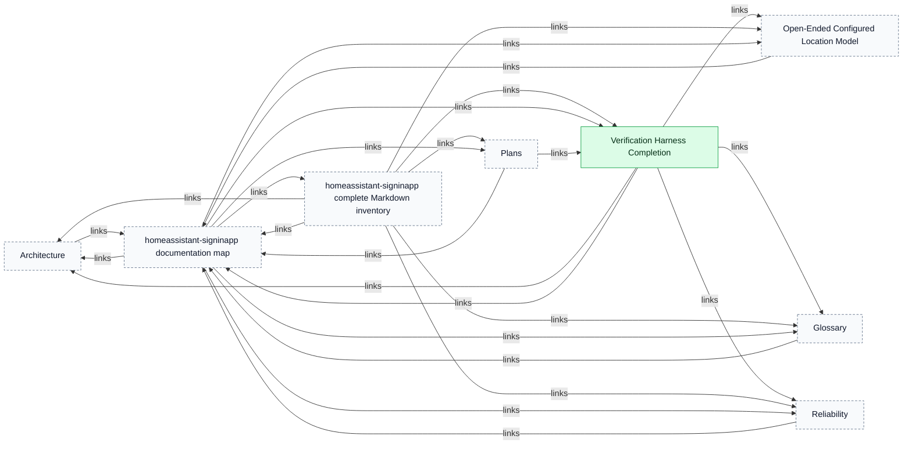
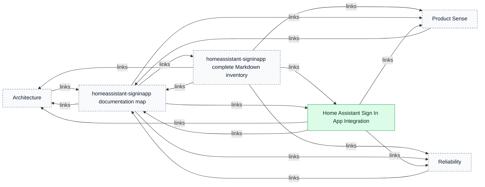
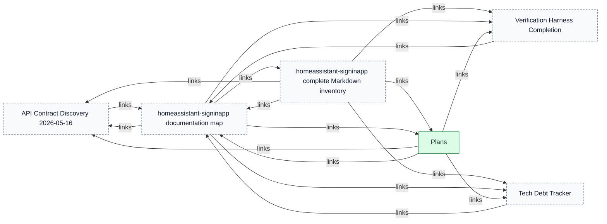
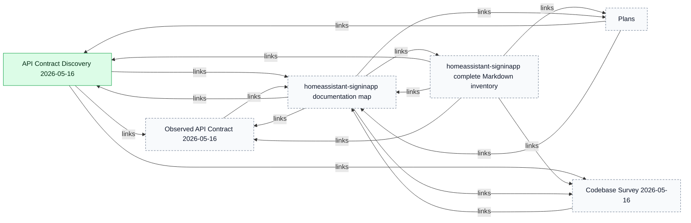

# homeassistant-signinapp

> Generated from repository-local OKF records. The Markdown/YAML bundle remains canonical.

Source: `homeassistant-signinapp`

The report separates the connected repository map from detailed component and key-concept views so large bundles remain reviewable.

## Connected-area overview

## Connected component 1

### docs

### repository root

### tasks

## Key concept neighbourhoods

### homeassistant-signinapp documentation map

### homeassistant-signinapp complete Markdown inventory

### Verification Harness Completion

### Home Assistant Sign In App Integration

### Plans

### API Contract Discovery 2026-05-16

## Legend

- Blue: task
- Purple: workstream
- Orange: tracker profile
- Green: durable knowledge
- Dashed neutral nodes: neighbouring context repeated from another area or key-concept view
- Time references: edges to addressable `Task.time[]` fragments
- Arrows: structured relationships or repository-local Markdown links
